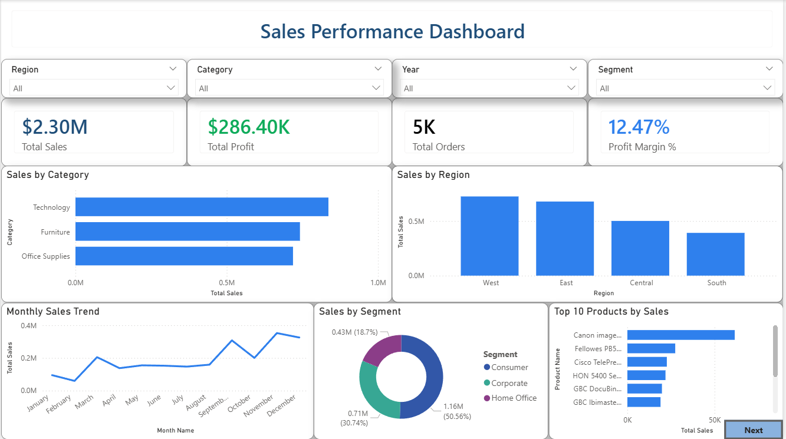

# 📊 Sales Performance Dashboard

## 📌 Project Overview

This project presents an interactive Sales Performance Dashboard built using Power BI. It provides insights into sales, profitability, customer segments, products, and regional performance to support business decision-making.

---

## 🚀 Features

- Interactive KPI Cards
- Sales Trend Analysis
- Regional Sales Analysis
- Product Performance
- Customer Segment Analysis
- Dynamic Filters (Region, Category, Year, Segment)
- Detailed Sales Analysis Page
- Page Navigation Buttons

---

## 🛠 Tools Used

- Power BI
- Power Query
- Microsoft Excel
- Data Cleaning
- DAX

---

## 📊 Dashboard Preview

### Sales Overview

### Detailed Analysis

---

## 📈 KPIs

- Total Sales
- Total Profit
- Total Orders
- Profit Margin %

---

## 📂 Dataset

The dashboard uses a retail sales dataset containing:

- Orders
- Products
- Customers
- Regions
- Categories
- Sales
- Profit
- Discount

---

## 📌 Business Insights

- Technology category generated the highest sales.
- West region contributed the highest revenue.
- Consumer segment accounted for the largest share of sales.
- California recorded the highest sales.
- Sales increased towards the end of the year.

---

## 👩‍💻 Author

Dhanvantari
